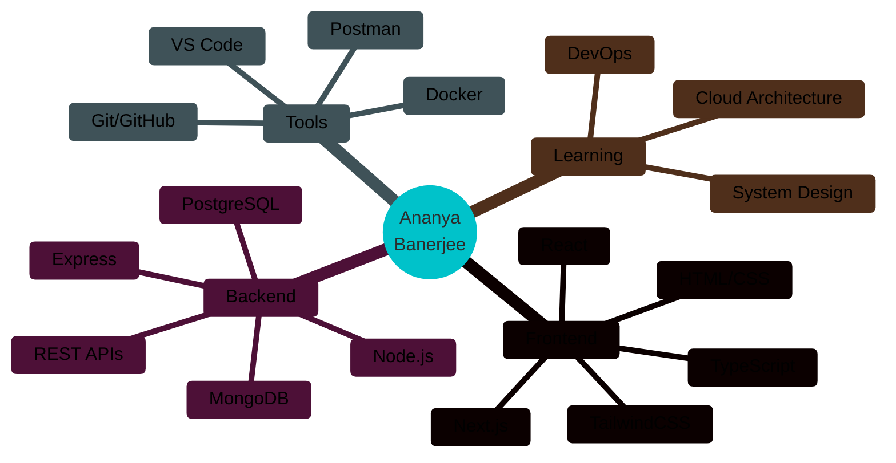

<div align="center">
  
#  Hi there, I'm Ananya


</div>

<div align="center">
  
[](https://github.com/ananya062111)
[](https://github.com/ananya062111)
[](https://github.com/ananya062111)

</div>

---


### 👨‍💻 About Me

```typescript
const Ananya = {
  pronouns: "She" | "Her",
  location: "India 🇮🇳",
  currentFocus: "Building Full Stack Applications",
  learning: ["System Design", "Cloud Architecture", "DevOps"],
  askMeAbout: ["Web Dev", "TypeScript", "React", "Node.js"],
  funFact: "I turn satellite data into real-world solutions 🚀"
};
```
# 💫 About Me:
🔭 I’m currently working on<br><br>GeoAI for Urban Futures – Urban growth & sprawl prediction using Google Earth Engine, Deep Learning & GANs<br><br>A real-estate analytics platform (housing.com–like) with urban sprawl index, AQI, LST & future growth prediction<br><br>Full-stack web projects using Next.js, Prisma, Supabase & FastAPI<br><br>👯 I’m looking to collaborate on<br><br>GeoAI / Remote Sensing / Satellite data projects<br><br>AI + Web platforms solving real-world urban, environmental, or infrastructure problems<br><br>Hackathons & open-source projects involving ML, Web3, or data visualization<br><br>🤝 I’m looking for help with<br><br>Advanced GAN architectures for spatio-temporal prediction<br><br>Scaling ML models for real-time or production deployment<br><br>Research paper writing & publication in GeoAI / Urban Analytics<br><br>🌱 I’m currently learning<br><br>Advanced Deep Learning (GANs, Transformers)<br><br>Web3 & Blockchain integration for trust-based platforms<br><br>Cloud & MLOps (Docker, AWS, deployment pipelines)<br><br>💬 Ask me about<br><br>Next.js full-stack development<br><br>Google Earth Engine & satellite data analysis<br><br>Urban growth modeling, GeoAI & ML<br><br>Hackathons, freelancing & solo product development<br><br>⚡ Fun fact<br><br>I built JEDSD.com completely solo as a freelancer 🚀<br><br>National-level hackathon finalist who loves turning research ideas into real products


---

### 🛠️ Tech Stack & Tools

<div align="center">

#### **Languages**


#### **Frameworks & Libraries**


#### **Databases & Tools**


#### **Deployment & Cloud**


</div>

---

### 📊 GitHub Statistics

<div align="center">


</div>

---

### 📈 Contribution Activity

<div align="center">

[](https://github.com/ananya062111)

</div>

---

### 🏆 GitHub Trophies

<div align="center">

[](https://github.com/ananya062111)

</div>

---

### 🎯 Featured Projects

<div align="center">

<a href="https://github.com/ananya062111/CodeAlpha_Task1">
  
</a>

<a href="https://github.com/ananya062111 /ananya062111 ">
  
</a>

</div>

---

### 🎨 Skills Visualization

<div align="center">



</div>

---

### 🌐 Connect With Me

<div align="center">

[](https://github.com/ananya062111)
[](https://linkedin.com/in/ananya062111)

</div>

---

<div align="center">

### 💭 Random Dev Quote

"Walking on water and developing software from a specification are easy if both are frozen." — Edward V. Berard

### 🐍 Contribution Snake


</div>

---

<div align="center">

### ⚡ "Code is like humor. When you have to explain it, it's bad." – Cory House


**Made with 💙 and lots of ☕**

</div>
